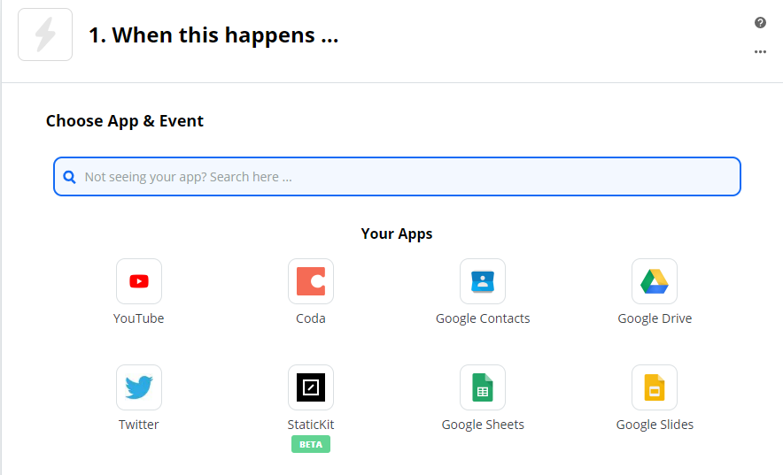
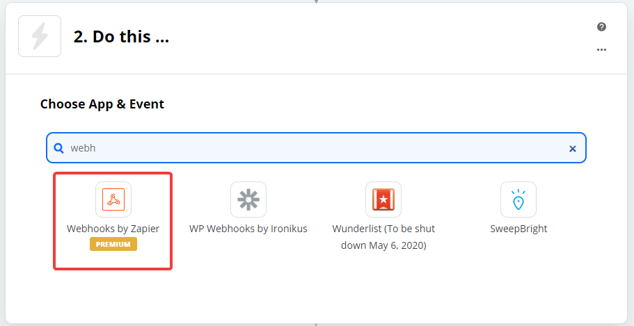
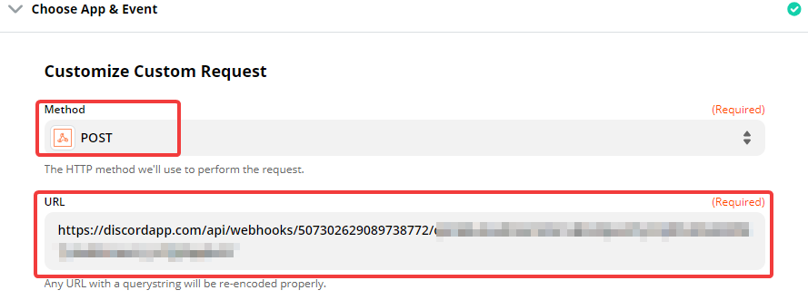
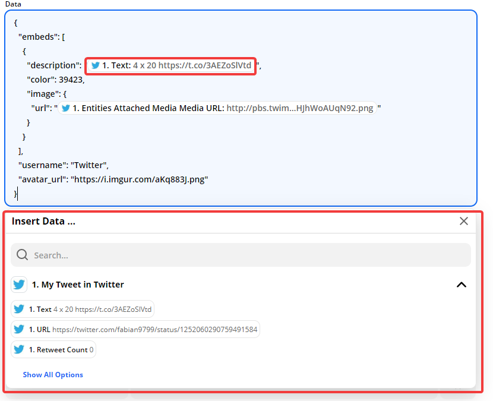
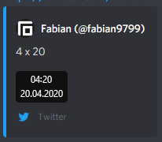

<!--StartFragment-->

## Zapier Account erstellen

Erstelle dir einen Zapier account auf <https://zapier.com/sign-up/>

## Anwendung verknüpfen

Erstelle dir hier einen neuen "Zap"<https://zapier.com/app/editor>

Wähle deine Anwendung aus die du Verbinden möchtest und Autorisiere dich damit

Wähle deinen "Auslöser" und wähle anschliessend deinen Account aus

Wähle im nächsten Schritt "Webhooks by Zapier" aus

Wähle als Aktion "Custom Request" aus

Wähle als "Methode" POST aus und füge unter URL die [Webhook](https://support.discordapp.com/hc/de/articles/228383668-Webhooks-verwenden) url ein

## Embed erstellen

Erstelle dir unter [https://discohook.org/](https://discohook.org/?message=eyJtZXNzYWdlIjp7fX0) den Inhalt der Gepostet werden soll. Achte darauf, dass du Felder die sich im nachhinein ändern mit Platzhaltern versehst

Kopiere dir anschliessend die "JSON data" welche unten auf der Website generiert wird.

Füge anschliessend deine Eigenen Daten hinzu

Füge unter "Headers" den folgenden Text ein:

> Content-Type application/json

Drücke anschliessend auf Continue und Teste ob eine Nachricht versendet wird

Drücke anschliessend auf Done und anschliessend auf "TURN ON ZAP"

<!--EndFragment-->