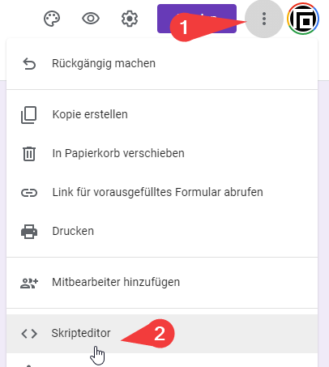
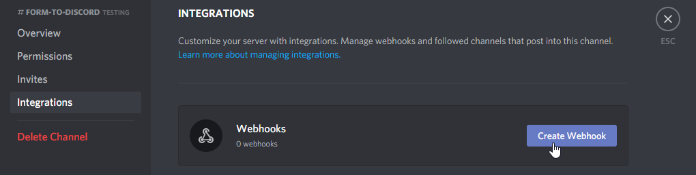
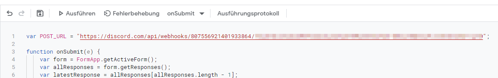
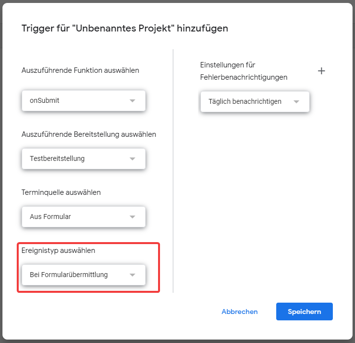
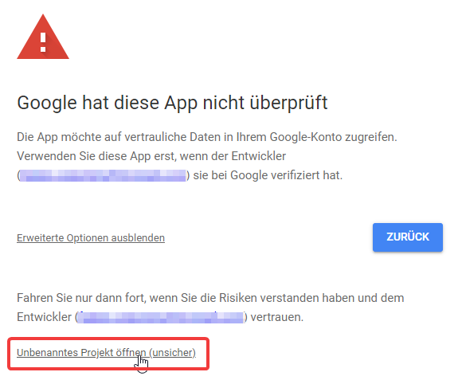

# 1. Formular erstellen

Erstelle ein Formular unter <http://forms.new/> und erstelle deine Fragen

# 2. Erstelle ein Skript

Drück auf die 3 Punkte und wähle "Skripteditor" aus

Kopiere dir den Inhalt von <https://n.fa97.de/p/aOzrpiFwR3> und füge ihn in den Codeeditor ein.

# 3. Webhook erstellen

Klicke in einem Text channel auf das Zahnrad und wähle anschliessend "Integrationen" aus.

Klicke da auf den "Webhook erstellen" button.

Gib einen Namen ein und lade in Profilbild hoch.

Kopiere dir anschliessend die Webhook url

Vergiss nicht auf den "Speichern" button in Discord zu klicken

# 4. Skript konfigurieren

Ersetze "WEBHOOK_URL" mit der kopierten Discord URL

Drücke anschliessend auf den "Speichern" button oben links

# 5. Trigger definieren

Klicke auf der Linken seite auf die Uhr (Trigger)

Klicke unten rechts auf "Trigger hinzufügen"

Wähle unter "Ereignistyp auswählen" die option "Bei Formularübermittlung" und klicke anschliessend auf Speichern

Klicke auf "Erweiterte Optionen" und anschliessend auf "Projekt öffnen"

Auf dem sich öffnenden Fenster auf "Erlauben" klicken

# 6. Testen

Sende das Formular ab und schau, ob eine Antwort in Discord ankommt

###### [source](https://github.com/Iku/Google-Forms-to-Discord)