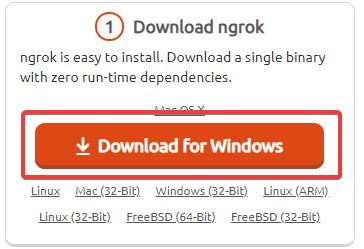
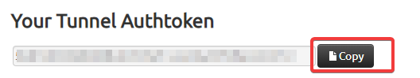
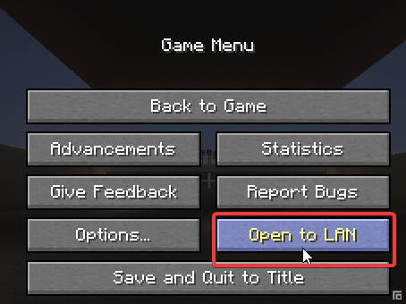
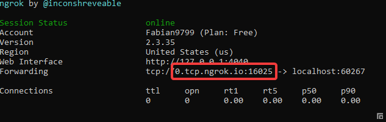

1. Als erstes musst du dir einen account auf [Ngrok](https://dashboard.ngrok.com/signup) erstellen.
2. Gehe auf die website <https://dashboard.ngrok.com/get-started> und klicke auf Download.

3. Entpacke die Zip Datei und starte die exe Datei.
4. Gehe auf <https://dashboard.ngrok.com/auth> und kopiere dir den "Tunnel Token".

5. gebe in dem Ngrok konsolenfenster das du auf deinem PC offen hast folgenden command ein. Ersetzt dabei DEIN_TOKEN mit dem "Tunnel Token" den du von der Website kopiert hast.

> ngrok authtoken DEIN_TOKEN

6. Starte anschliessend Minecraft und öffne die Welt als LAN

7. Kopiere dir anschliessend den Port der im Chat angezeigt wird.

8. Gib anschliessend im Konsolenfenster den folgenden Befehl ein. Ersetze den DEIN_PORT teil durch den Port der im Chat angezeigt wird.

> ngrok tcp DEIN_PORT

9. Anschliessend wird dir ein Fenster angezeigt welches dir die IP vom Server anzeigt

10. Deine Freunde können jetzt mit der oben angezeigten IP auf deinen Server joinen

> TIPP:\
> Falls du einen Server von deinem PC aus betreiben willst musst du in den server.properties Datei deines Servers den Port der da eingetragen ist für den "ngrok tcp DEIN_PORT" command verwenden

<!--EndFragment-->