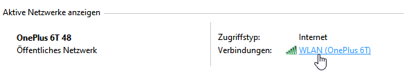
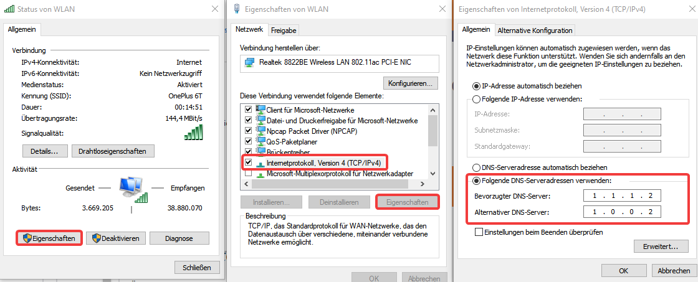
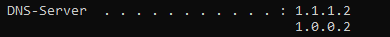

# 1. Systemsteuerung

Öffne die Systemsteuerung und klicke auf "Netzwerk und Internet" und anschliessend auf "Netzwerk- und Freugabecenter"

Alternativ einen beliebigen Ordner öffnen und "Systemsteuerung\Netzwerk und Internet\Netzwerk- und Freigabecenter" in die leiste oben eingeben und Enter drücken.

# 2. Auf das aktive Netzwerk klicken



# 3. Einstellungen verändern

Klicke anschliessend auf Eigenschaften > IPv4 > Eigenschaften > Folgende DNS-Serveradressen verwenden

Tippe schliessend in das erste Feld die folgende IP Adresse ein: 1.1.1.2

Anschliessend 1.0.0.2 in das zweite Fenster.

Klicke anschliessend bei jedem Fenster auf "OK" und die Änderungen zu bestätigen



# 4. Flush DNS

Falls die DNS Server nicht sofort übernommen wurden öffne die Konsole und tippe folgendes in die Konsole:

```
ipconfig /flushdns
```

Gib im anschluss den folgenden command ein und zu überprüfen, ob die nameserver übernommen wurden:

```
ipconfig /all
```

Falls da das folgende steht wurden die DNS Server übernommen und du kannst alle Fenster schliessen.



# Alternative nameserver:

**Standard Cloudflare Nameserver:**

1.1.1.1

1.0.0.1

**Malware blockieren:**

1.1.1.2

1.0.0.2

**Malware und erwachsenen Content blockieren:**

1.1.1.3

1.0.0.3

**Google Nameserver:**

8.8.8.8

8.8.4.4