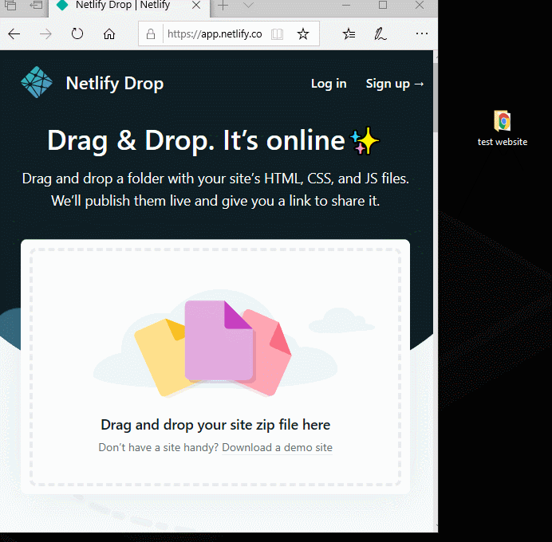

<!--StartFragment-->

1. Die Website <https://app.netlify.com/drop> öffnen
2. ordner auf die Website ziehen
3. auf den **netlify.app** link klicken

Falls es immer noch leute gibt die das nicht verstehen, hier das offizielle Video von Netlify dazu:

<iframe width="560" height="315" src="https://www.youtube-nocookie.com/embed/-LRlQ_jaLAU" frameborder="0" allow="accelerometer; autoplay; clipboard-write; encrypted-media; gyroscope; picture-in-picture" allowfullscreen></iframe>